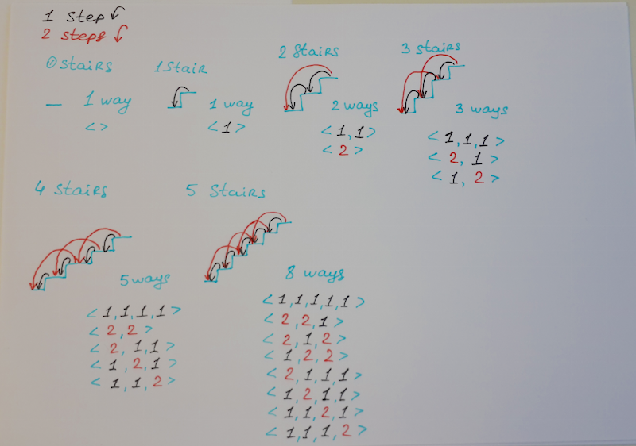
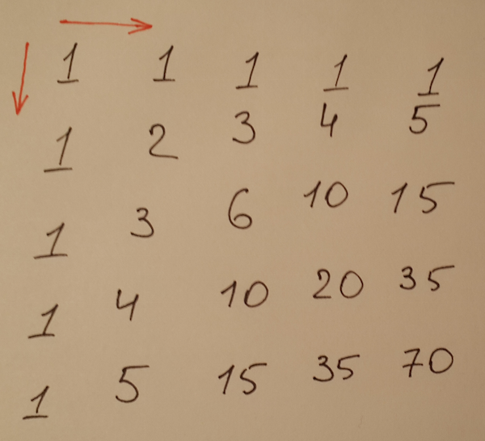
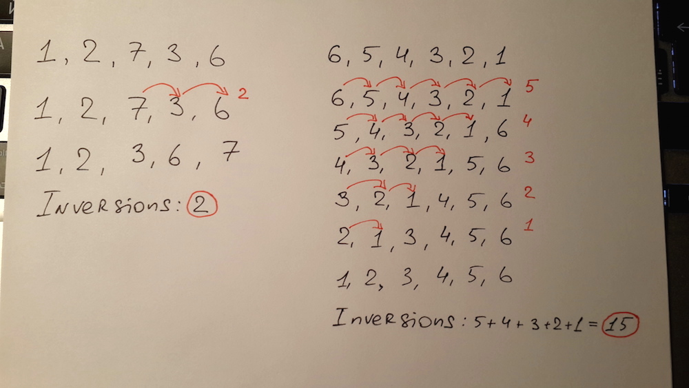
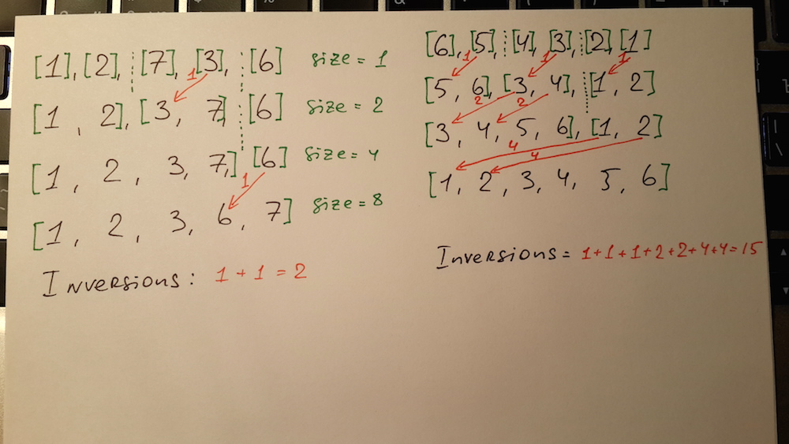

1. Install Java 8.

2. Run `./gradlew check`

## Materials

### 22 Directed Graph Representations
- [Wikipedia Graph (discrete mathematics)](https://en.wikipedia.org/wiki/Graph_%28discrete_mathematics%29)
- [Wikipedia Graph (abstract data type)](https://en.wikipedia.org/wiki/Graph_%28abstract_data_type%29)
- [Wikipedia Directed Graph (discrete mathematics)](https://en.wikipedia.org/wiki/Graph_%28discrete_mathematics%29#Directed_graph)
- [Wikipedia Directed Graph](https://en.wikipedia.org/wiki/Directed_graph)
- [Wikipedia Undirected Graph (discrete mathematics)](https://en.wikipedia.org/wiki/Graph_%28discrete_mathematics%29#Undirected_graph)
- [Wikipedia Adjacency matrix](https://en.wikipedia.org/wiki/Adjacency_matrix)
- [Wikipedia Adjacency list](https://en.wikipedia.org/wiki/Adjacency_list)

Participants:
[@andreysobol](https://github.com/andreysobol),
[@SunnyMagadan](https://github.com/SunnyMagadan),
[@kirpichenko](https://github.com/kirpichenko) 
Host: [@ffbit](https://github.com/ffbit)

### 21 AVL Binary Search Tree
- [Wikipedia AVL tree](https://en.wikipedia.org/wiki/AVL_tree)
- [Visualgo - Binary search tree (Click the AVL TREE tab on the top)](http://visualgo.net/bst.html)
- 
- 
- [MIT 6.006 Introduction to Algorithms, Fall 2011 Download Course Materials](http://ocw.mit.edu/ans15436/ZipForEndUsers/6/6-006-fall-2011/6-006-fall-2011.zip)

Participants:
[@andreysobol](https://github.com/andreysobol),
[@SunnyMagadan](https://github.com/SunnyMagadan),
[@kirpichenko](https://github.com/kirpichenko) 
Host: [@ffbit](https://github.com/ffbit)

### 20 Rotate Array and 3 Sum
- [Leetcode 189. Rotate Array](https://leetcode.com/problems/rotate-array/)
- [Leetcode 15. 3 Sum](https://leetcode.com/problems/3sum/)

Participants:
[@andreysobol](https://github.com/andreysobol),
[@SunnyMagadan](https://github.com/SunnyMagadan),
[@kirpichenko](https://github.com/kirpichenko),
[@DZozulya](https://github.com/DZozulya) 
Host: [@ffbit](https://github.com/ffbit)

### 19 N Sum
- [Leetcode 1. 2 Sum](https://leetcode.com/problems/two-sum/)
- [Leetcode 15. 3 Sum](https://leetcode.com/problems/3sum/)
- [Leetcode 228. Summary Ranges](https://leetcode.com/problems/summary-ranges/)

Participants:
[@andreysobol](https://github.com/andreysobol),
[@atermenji](https://github.com/atermenji),
[@SunnyMagadan](https://github.com/SunnyMagadan),
[@kirpichenko](https://github.com/kirpichenko),
[@DZozulya](https://github.com/DZozulya) 
Host: [@ffbit](https://github.com/ffbit)

### 18 Unbalanced Binary Search Tree
 - [Wikipedia Binary Search Tree](https://en.wikipedia.org/wiki/Binary_search_tree)
 - [Visualgo - Binary search tree](http://visualgo.net/bst.html)

Participants:
[@andreysobol](https://github.com/andreysobol),
[@atermenji](https://github.com/atermenji) 
Host: [@ffbit](https://github.com/ffbit)

### 17 Dictionary (Hash Table)
 - [Wikipedia Hash table](https://en.wikipedia.org/wiki/Hash_table)

Participants:
[@andreysobol](https://github.com/andreysobol),
[@SunnyMagadan](https://github.com/SunnyMagadan),
[@DZozulya](https://github.com/DZozulya) 
Host: [@ffbit](https://github.com/ffbit)

### 16 Dynamic Programming III
 - [Wikipedia Dynamic programming](https://en.wikipedia.org/wiki/Dynamic_programming)
 - [Leetcode 120 Triangle](https://leetcode.com/problems/triangle/)
 - [Leetcode 72 Edit Distance](https://leetcode.com/problems/edit-distance/)
 - [Dan Jurafsky - Min Edit Distance](https://web.stanford.edu/class/cs124/lec/med.pdf)
 - [Wikipedia Edit Distance](https://en.wikipedia.org/wiki/Edit_distance)

Participants:
[@andreysobol](https://github.com/andreysobol),
[@DZozulya](https://github.com/DZozulya) 
Host: [@ffbit](https://github.com/ffbit)

### 15 Dynamic Programming II
 - [Wikipedia Dynamic programming](https://en.wikipedia.org/wiki/Dynamic_programming)
 - [Leetcode 70 Climbing Stairs](https://leetcode.com/problems/climbing-stairs/)
 - 
 - [Wikipedia Fibonacci number](https://en.wikipedia.org/wiki/Fibonacci_number)
 - [Leetcode 198 House Robber](https://leetcode.com/problems/house-robber/)
 - [Leetcode 279 Perfect Squares](https://leetcode.com/problems/perfect-squares/)

Participants:
[@andreysobol](https://github.com/andreysobol),
[@SunnyMagadan](https://github.com/SunnyMagadan),
[@stanislaw](https://github.com/stanislaw),
[@DZozulya](https://github.com/DZozulya) 
Host: [@ffbit](https://github.com/ffbit)

### 14 MultiWay Merge and Dynamic Programming
 - [Leetcode 23 Merge k Sorted Lists](https://leetcode.com/problems/merge-k-sorted-lists/)
 - [Wikipedia Binary heap](https://en.wikipedia.org/wiki/Binary_heap#Insert)
 - [Wikipedia Heapsort](https://en.wikipedia.org/wiki/Heapsort)
 - [Wikipedia Dynamic programming](https://en.wikipedia.org/wiki/Dynamic_programming)
 - [Leetcode 62 Unique Paths](https://leetcode.com/problems/unique-paths/) 
    
   
 - [Wikipedia Pascal's triangle](https://en.wikipedia.org/wiki/Pascal%27s_triangle) 
 - [Wikipedia Binomial_coefficient](https://en.wikipedia.org/wiki/Binomial_coefficient)
 - [Wikipedia Binomial_coefficient Multiplicative_formula](https://en.wikipedia.org/wiki/Binomial_coefficient#Multiplicative_formula)
 - [Leetcode 63 Unique Paths II](https://leetcode.com/problems/unique-paths-ii/)

Participants:
[@andreysobol](https://github.com/andreysobol),
[@DZozulya](https://github.com/DZozulya) 
Host: [@ffbit](https://github.com/ffbit)

### 13 Sorting III
 - [Sorting Algorithm Animations](http://www.sorting-algorithms.com/)
 - [Wikipedia Bubble sort](https://en.wikipedia.org/wiki/Bubble_sort)
 - [Wikipedia Binary heap](https://en.wikipedia.org/wiki/Binary_heap#Insert)
 - [Wikipedia Heapsort](https://en.wikipedia.org/wiki/Heapsort)
 - 

Participants:
[@andreysobol](https://github.com/andreysobol),
[@SunnyMagadan](https://github.com/SunnyMagadan) 
Host: [@ffbit](https://github.com/ffbit)

### 12 Sorting II
 - [Sorting Algorithm Animations](http://www.sorting-algorithms.com/)
 - [Wikipedia Quicksort](https://en.wikipedia.org/wiki/Quicksort)
 - [QUICKSORT IS OPTIMAL by Robert Sedgewick and Jon Bentley](http://www.sorting-algorithms.com/static/QuicksortIsOptimal.pdf)
 - [Wikipedia Inversion](https://en.wikipedia.org/wiki/Inversion_(discrete_mathematics))
 - 
 - 

Participants:
[@andreysobol](https://github.com/andreysobol),
[@atermenji](https://github.com/atermenji),
[@kirpichenko](https://github.com/kirpichenko) 
Host: [@ffbit](https://github.com/ffbit)

### 11 Sorting I
 - [Sorting Algorithm Animations](http://www.sorting-algorithms.com/)
 - [Wikipedia Selection sort](https://en.wikipedia.org/wiki/Selection_sort)
 - [Wikipedia Insertion sort](https://en.wikipedia.org/wiki/Insertion_sort)
 - [Wikipedia Shellsort](https://en.wikipedia.org/wiki/Shellsort)
 - [Wikipedia Merge sort Top Down](https://en.wikipedia.org/wiki/Merge_sort#Top-down_implementation)
 - [Wikipedia Merge sort Bottom Up](https://en.wikipedia.org/wiki/Merge_sort#Bottom-up_implementation)

Participants:
[@andreysobol](https://github.com/andreysobol),
[@akavrt](https://github.com/akavrt),
[@DZozulya](https://github.com/DZozulya),
[@kirpichenko](https://github.com/kirpichenko),
[@SunnyMagadan](https://github.com/SunnyMagadan) 
Host: [@ffbit](https://github.com/ffbit)

### 10 Binary Tree
 - [Leetcode 199 Binary Tree Right Side View](https://leetcode.com/problems/binary-tree-right-side-view/)
 - [Leetcode 100 Same Tree](https://leetcode.com/problems/same-tree/)
 - [Leetcode 226 Invert Binary Tree](https://leetcode.com/problems/invert-binary-tree/)

Participants:
[@andreysobol](https://github.com/andreysobol),
[@akavrt](https://github.com/akavrt),
[@SunnyMagadan](https://github.com/SunnyMagadan) 
Host: [@ffbit](https://github.com/ffbit)

### 9 Binary Tree Traversal, Height and (De)Serialization
 - [Wikipedia Level-order](https://en.wikipedia.org/wiki/Tree_traversal#/media/File:Sorted_binary_tree_breadth-first_traversal.svg)
 - [Leetcode 102 Binary Tree Level Order Traversal](https://leetcode.com/problems/binary-tree-level-order-traversal/)
 - [Leetcode 104 Maximum Depth of Binary Tree](https://leetcode.com/problems/maximum-depth-of-binary-tree/)
 - [Leetcode 297 Serialize and Deserialize Binary Tree](https://leetcode.com/problems/serialize-and-deserialize-binary-tree/)

Participants:
[@andreysobol](https://github.com/andreysobol),
[@SunnyMagadan](https://github.com/SunnyMagadan), [@kirpichenko](https://github.com/kirpichenko), [@atermenji](https://github.com/atermenji), [@DZozulya](https://github.com/DZozulya) 
Host: [@ffbit](https://github.com/ffbit)

### 8 Binary Tree Traversal
- [Tree (data structure)](https://en.wikipedia.org/wiki/Tree_(data_structure))
- [Tree traversal](https://en.wikipedia.org/wiki/Tree_traversal)
- [Leetcode 144 Binary Tree Preorder Traversal](https://leetcode.com/problems/binary-tree-preorder-traversal/)
- [Leetcode 94 Binary Tree Inorder Traversal](https://leetcode.com/problems/binary-tree-inorder-traversal/)
- [Leetcode 145 Binary Tree Postorder Traversal](https://leetcode.com/problems/binary-tree-postorder-traversal/)

Participants:
[@andreysobol](https://github.com/andreysobol),
[@akavrt](https://github.com/akavrt),
[@SunnyMagadan](https://github.com/SunnyMagadan) 
Host: [@ffbit](https://github.com/ffbit)

### 7 Array
- [Contains Duplicate](https://leetcode.com/problems/contains-duplicate/)
- [Majority Element](https://leetcode.com/problems/majority-element/)
- [A Linear Time Majority Vote Algorithm](http://www.cs.utexas.edu/~moore/best-ideas/mjrty/)
- [Plus One](https://leetcode.com/problems/plus-one/)
- [Remove Element](https://leetcode.com/problems/remove-element/)

Participants:
[@andreysobol](https://github.com/andreysobol),
[@akavrt](https://github.com/akavrt),
[@kirpichenko](https://github.com/kirpichenko),
[@SunnyMagadan](https://github.com/SunnyMagadan) 
Host: [@ffbit](https://github.com/ffbit)

### 6 Stack, Queue, Dynamic List and Binary Search
- [Stack (abstract data type)](https://en.wikipedia.org/wiki/Stack_(abstract_data_type))
- [Queue (abstract data type)](https://en.wikipedia.org/wiki/Queue_(abstract_data_type))
- [Implement Stack using Queues](https://leetcode.com/problems/implement-stack-using-queues/)
- [Implement Queue using Stacks](https://leetcode.com/problems/implement-queue-using-stacks/)
- [List (abstract data type)](https://en.wikipedia.org/wiki/List_(abstract_data_type))
- [Linked list](https://en.wikipedia.org/wiki/Linked_list)
- [Doubly linked list](https://en.wikipedia.org/wiki/Doubly_linked_list)
- [Dynamic array](https://en.wikipedia.org/wiki/Dynamic_array)
- [Binary search algorithm](https://en.wikipedia.org/wiki/Binary_search_algorithm)

Participants: [@andreysobol](https://github.com/andreysobol),
[@akavrt](https://github.com/akavrt), [@kirpichenko](https://github.com/kirpichenko) 
Host: [@ffbit](https://github.com/ffbit)

### 5 Stack and Queue
- [Min Stack](https://leetcode.com/problems/min-stack/)
- [Evaluate Reverse Polish Notation](https://leetcode.com/problems/evaluate-reverse-polish-notation/)
- [Queue (abstract data type)](https://en.wikipedia.org/wiki/Queue_(abstract_data_type))
- [Wikipedia Linked_list#Singly_linked_list](https://en.wikipedia.org/wiki/Linked_list#Singly_linked_list)
- [Queue](http://visualgo.net/)
- [Circular buffer](https://en.wikipedia.org/wiki/Circular_buffer)
- [Basic Calculator](https://leetcode.com/problems/basic-calculator/)
- [Shunting-yard algorithm](https://en.wikipedia.org/wiki/Shunting-yard_algorithm)

Participants: [@andreysobol](https://github.com/andreysobol), [@SunnyMagadan](https://github.com/SunnyMagadan) 
Host: [@ffbit](https://github.com/ffbit)

### 4 Stack links
- [Stack (abstract data type)](https://en.wikipedia.org/wiki/Stack_(abstract_data_type))
- [Stack on Linked List](http://visualgo.net/list.html)
- [Simple Balanced Parentheses](http://interactivepython.org/runestone/static/pythonds/BasicDS/SimpleBalancedParentheses.html)
- [Valid Parentheses](https://leetcode.com/problems/valid-parentheses/)

### 3 Math links

- [Missing Number](https://leetcode.com/problems/missing-number/)
- [The sum of the first n natural numbers](http://www.9math.com/book/sum-first-n-natural-numbers)
- [Sqrt(x)](https://leetcode.com/problems/sqrtx/)
- 
- [**Video** Lecture 1.5 - Example: square roots with Newton's method](https://class.coursera.org/progfun-2012-001/lecture/6)
- [Single Number](https://leetcode.com/problems/single-number/)
- [Single Number II](https://leetcode.com/problems/single-number-ii/)

### 2 Singly Linked List links

- [Wikipedia Linked_list#Singly_linked_list](https://en.wikipedia.org/wiki/Linked_list#Singly_linked_list)
- [Linked List](http://visualgo.net/list.html)
- [Wikipedia Cycle detection](https://en.wikipedia.org/wiki/Cycle_detection)
- [FLOYD'S TORTOISE-HARE CYCLE-FINDING](http://visualgo.net/cyclefinding.html)
- [Intersection of Two Linked Lists ](https://leetcode.com/problems/intersection-of-two-linked-lists/)
- [Linked List Cycle](https://leetcode.com/problems/linked-list-cycle/)
- [Linked List Cycle II ](https://leetcode.com/problems/linked-list-cycle-ii/)

### 1 Math links

- [Greatest common divisor](https://en.wikipedia.org/wiki/Greatest_common_divisor )
- [Bitwise operation](https://en.wikipedia.org/wiki/Bitwise_operation)
- [Exponentiation](https://en.wikipedia.org/wiki/Exponentiation)
- [Logarithm](https://en.wikipedia.org/wiki/Logarithm)
- [Recursion](https://en.wikipedia.org/wiki/Recursion)
